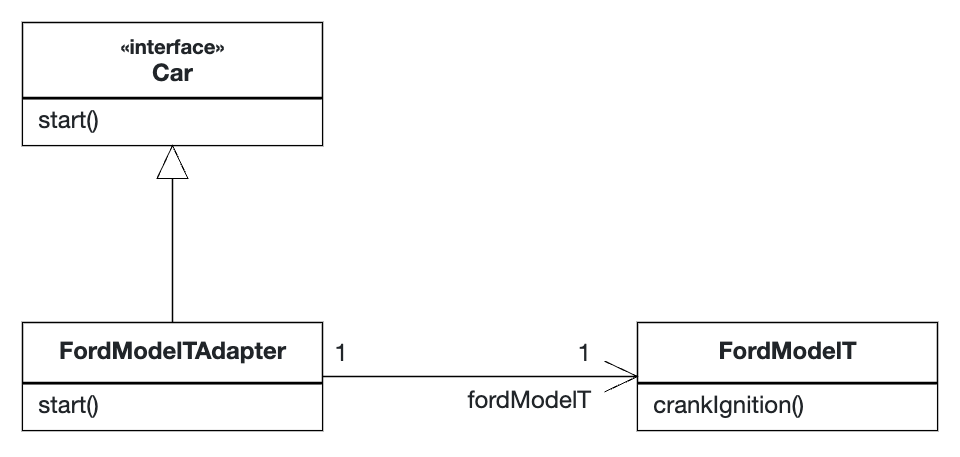

# Adapter Pattern

## Rationale

The Adapter Pattern is used for situations where a class has to implement an interface that is not available in the class itself.
This could easily happen in legacy code.

For example, the following code is used to implement the [`Car`](Car.java) interface for the [`FordModelT`](FordModelT.java) class by using
 [`FordModelTAdapter`](FordModelTAdapter.java).

## UML Diagram

