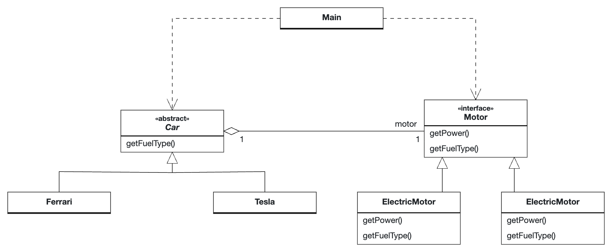

# Bridge Pattern

## Rationale

The Bridge Pattern is used for situations where you want to delay the binding between an interface and its subclass to runtime.

For example, the following code is used to let the user choose the type of [`Motor`](Motor.java) he wants to use for a [`Tesla`](Tesla.java)
and [`Ferrari`](Ferrari.java).

## UML Diagram

