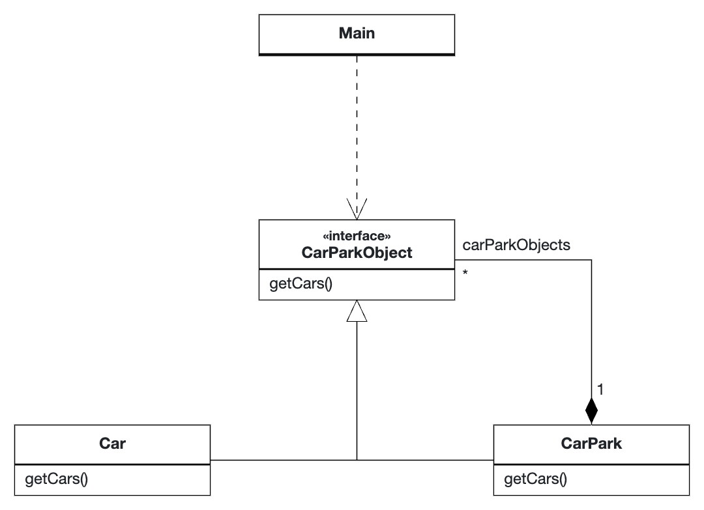

# Composite Pattern

## Rationale

The Composite Pattern is used for situations where you want to group objects in a tree structure to represent a part of the whole.

For example, the following code is used to represent a [`CarPark`](CarPark.java) with subsidiary `CarParks` and its [`Cars`](Car.java) as [`CarParkObjects`](CarParkObject.java).

## UML Diagram

