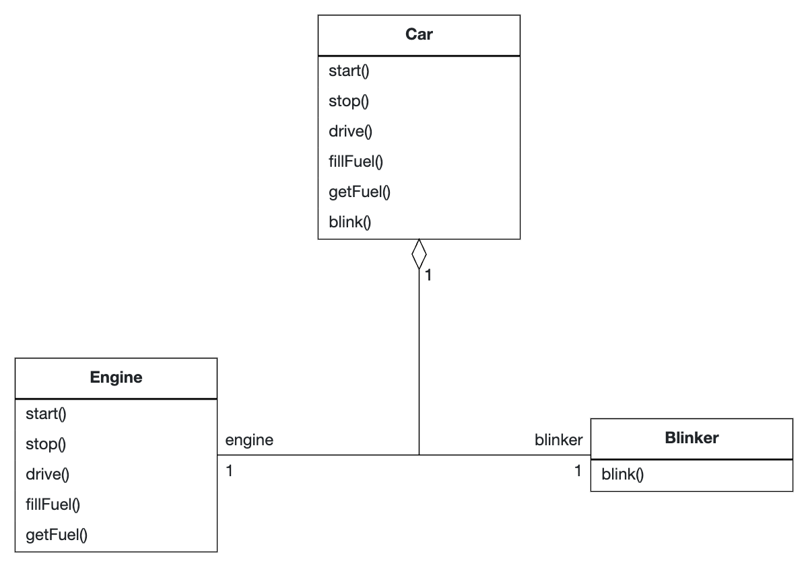

# Facade Pattern

## Rationale

The Facade Pattern is used for situations where you want to provide a simplified interface to a large subsystem.
Its calls are delegated to the subsystem.

For example, the following code is used to let the user control the whole subsystem [`Car`](Car.java) which includes 
[`Blinker`](Blinker.java) and [`Engine`](Engine.java) using only the `Car`.

## UML Diagram

