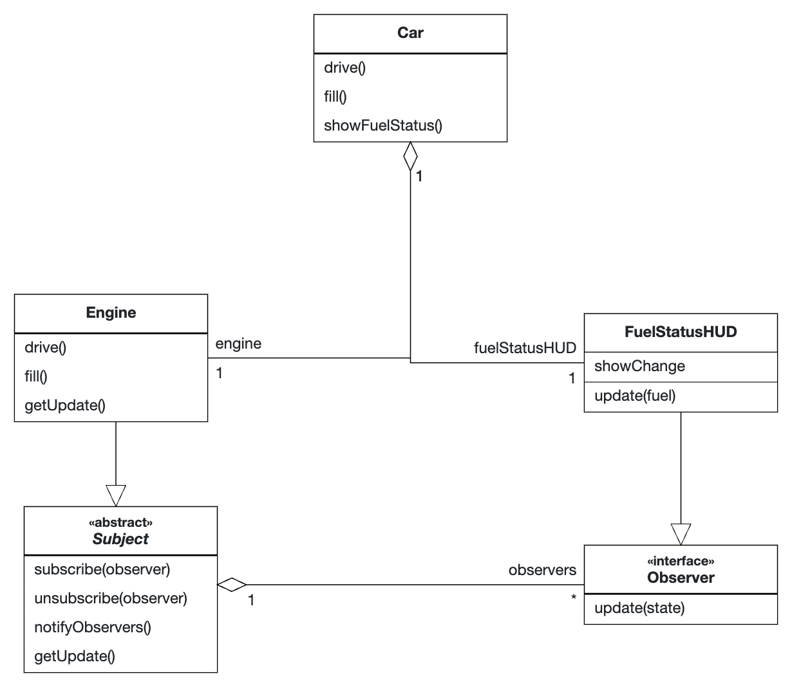

# Observer Pattern

## Rationale

The Observer Pattern is used for situations where you want to be notified of changes in the state of an object.

For example, the following code is used to notify the [`FuelStatusHUD`](FuelStatusHUD.java) about changes in the fuel status of an [`Engine`](Engine.java) of a [`Car`](Car.java).

## UML Diagram

