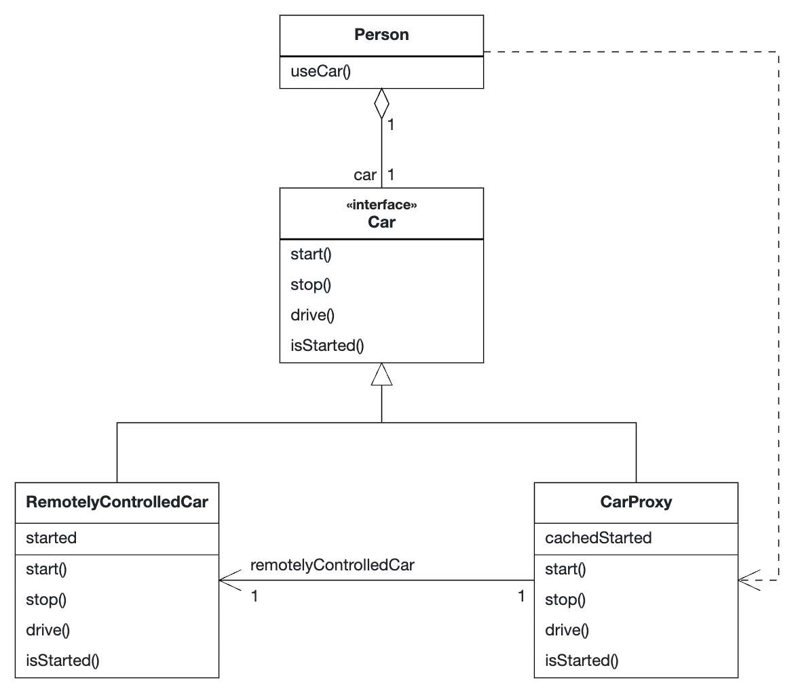

# Proxy Pattern

## Rationale

The Proxy Pattern is used for situations where you want to delay the instantiation of an object until it is used or to minimize remote access by mostly using local objects.

For example, the following code is used to minimize calls to a [remotely controlled car](RemoteControlledCar.java) by storing the `started` attribute locally in the [`CarProxy`](CarProxy.java) and checking it before passing
control commands to the remote car.

## UML Diagram

