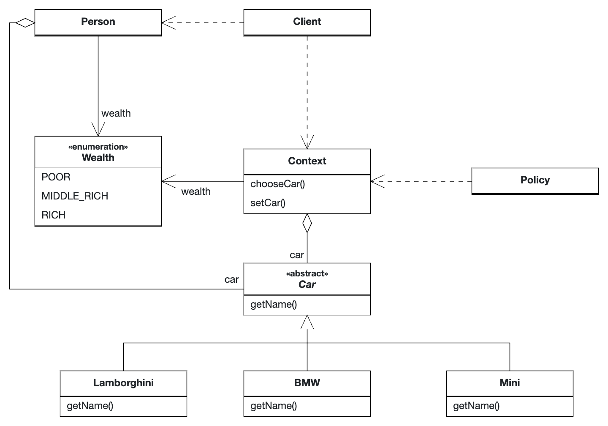

# Strategy Pattern

## Rationale

The Strategy Pattern is used for situations where you want to use different algorithms for different situations.

For example, the following code is used to let a [`Person`](Person.java) know which car to choose depending on the `Person`'s wealth.
The [`Policy`](Policy.java) class is used to determine which car to choose and the [`Context`](Context.java) provides the context for this decision.

## UML Diagram

