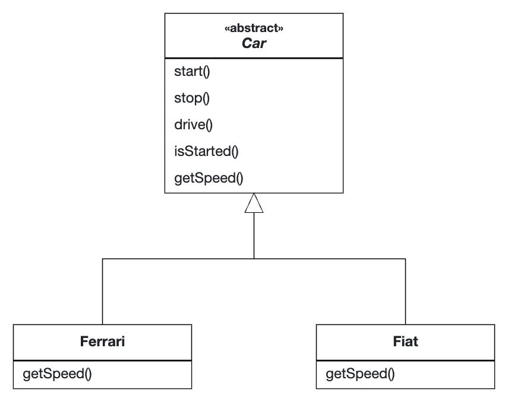

# Template Method Pattern

## Rationale

The Template Method Pattern is used when you have a superclass that defines a method which is a skeleton of 
an algorithm which uses multiple customizable high-level steps defined in subclasses.

For example, the following code is used to customize a [`Ferrari`](Ferrari.java) and a [`Fiat`](Fiat.java) depending on its
features (in this case speed) while reusing the same skeleton provided by the [`Car`](Car.java) class.

## UML Diagram

